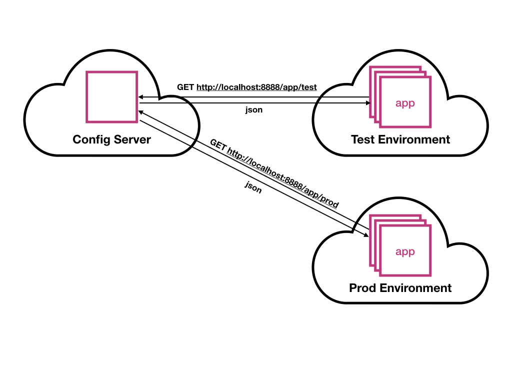

# Spring Cloud Config
The introduction of the cloud infrastructures have changed the way applications are deployed. No longer is an application assigned to a specific machine or a virtual machine. The location of an application is dynamically chosen by available resources within a cluster of machines.   
 
The dynamic nature of the deployment makes configuring the application difficult. No longer will it suffice to copy configuration files around or mount volumes with configuration files. 

Spring Cloud Config introduces an idea of a configuration server and client to help solve the problem of providing configuration data. The Spring Config Server is a simple Spring Boot application that provides configuration properties to clients via HTTP (key-value pairs). 

The server uses a pattern for serving application properties. The application name and profile are used to as part of a REST URL to access properties (Ex: `http://localhost:8888/$application/$profile`).



The server can provide configuration data from a filesystem or Git repository. This demo focuses on using the filesystem to manage configuration data because it is easier to package up into a demo. However, applications intended for production should use Git. Git will allow the configuration data to be managed like source code. 

## Introduce a Greeting Service

Start by introducing a Spring Boot application that provides a greeting via a `/hello` endpoint. 

```java
package com.rseanking.client;

import org.springframework.beans.factory.annotation.Value;
import org.springframework.boot.SpringApplication;
import org.springframework.boot.autoconfigure.SpringBootApplication;
import org.springframework.web.bind.annotation.RequestMapping;
import org.springframework.web.bind.annotation.ResponseBody;
import org.springframework.web.bind.annotation.RestController;

@SpringBootApplication
@RestController
public class ClientApplication {
	@Value("${hello.greeting:Hello}")
	private String greeting;
	
	@RequestMapping("/hello")
	@ResponseBody
	public String greeting() {
		return greeting;
	}

	public static void main(String[] args) {
		SpringApplication.run(ClientApplication.class, args);
	}
}
```
Since the `${hello.greeting}` property isn't provided the `/hello` endpoint will default the greeting to 'Hello'.

```http
$ curl -XGET -s http://localhost:8080/hello -w '\n'
Hello
```

## Building a Configuration Server

Next, introduce a configuration server to support the greeting service. The configuration server will provide a different greeting for each profile (default, dev, prod, ...).

Introduce the `spring-cloud-config-server` dependency to provide the libraries needed to quickly spin up a cloud configuration server.

```xml
<dependencies>
    ... 
    <dependency>
        <groupId>org.springframework.cloud</groupId>
        <artifactId>spring-cloud-config-server</artifactId>
    </dependency>
    ... 
</dependencies>
```

Next, introduce a Spring Boot application and annotate it with the `@EnableConfigServer` annotation. It's that simple!

```java
package com.rseanking.server;

import org.springframework.boot.SpringApplication;
import org.springframework.boot.autoconfigure.SpringBootApplication;
import org.springframework.cloud.config.server.EnableConfigServer;

@EnableConfigServer
@SpringBootApplication
public class ServerApplication {

    public static void main(String[] args) {
        SpringApplication.run(ServerApplication.class, args);
    }
}
```

Update the server's configuration to serve configuration properties from `src/main/resources/configRepo`.   

```yml
server.port=8888
spring.config.name=configserver

# Required to read from local filesytem
spring.profiles.active=native 
# Repository of configuration properties
spring.cloud.config.server.native.search-locations=classpath:configRepo/ 
```

Introduce configuration data to support the `greeting-service` application. These setting will supply default setttings and support for a dev profile.

```
$ echo 'hello.greeting=Hello!' > src/main/resources/configRep/greeting-service.properties
$ echo 'hello.greeting=Hello Dev!' > src/main/resources/configRep/greeting-service-dev.properties
```

The dev configuration for the `greeting-service` can now be accessed via `http://localhost:8888/greeting-service/dev`.

```json
$ curl -XGET -s http://localhost:8888/greeting-service/dev | jq
{
  "name": "greeting-service",
  "profiles": [
    "dev"
  ],
  "label": null,
  "version": null,
  "state": null,
  "propertySources": [
    {
      "name": "classpath:configRepo/greeting-service-dev.properties",
      "source": {
        "hello.greeting": "Hello Dev!"
      }
    },
    {
      "name": "classpath:configRepo/greeting-service.properties",
      "source": {
        "hello.greeting": "Hello!"
      }
    }
  ]
}
```
The results contain the default properties for the `greeting-service` and the properties being overridden by the dev profile.

## Update the Greeting Service

The greeting service can now be updated to utilize the configuration server. Introduce the `spring-cloud-starter-config` dependency into the pom.xml to provide the libraries needed for the greeting service to communicate with the configuration server.

```xml
<dependencies>
    ...
    <dependency>
        <groupId>org.springframework.cloud</groupId>
        <artifactId>spring-cloud-starter-config</artifactId>
    </dependency>
    ...
</dependencies>
```

Introduce a `src/main/resources/bootstrap.properties`. The `bootstrap.properties` file will configure the client to communicate with the configuration server. 

```yml
spring.application.name=greeting-service
spring.profiles.active=dev

spring.cloud.config.uri=http://localhost:8888

# Disable security for demo
management.security.enabled=false
```

The `spring.cloud.config.uri`, `spring.application.name` and `spring.profiles.active` are important properties as they will be used to build a URL to acquire the application properties from the configuration server (URL: `http://localhost:8888/greeting-service/dev`). 

Running the greeting service with an active profile of `dev` will now produce `Hello Dev!`. 

```http
$ curl -XGET -s http://localhost:8080/hello -w '\n'
Hello Dev!
```

Running the greeting service without an active profile will produce `Hello!`, because it uses the `default` profile.

```http
$ curl -XGET -s http://localhost:8080/hello -w '\n'
Hello!
```

## Summary

Introducing a Spring Cloud configuration server allows the configuration data to be segregated away from the applications. The segregation enables administrators to do things more effectively. An application can more easily be managed through different environments within a cloud environment. It also allows the configuration data to be managed like a traditional code base using Git.

The source for this demo can be found on GitHub: [https://github.com/seanking/spring-cloud-config](https://github.com/seanking/spring-cloud-config)

